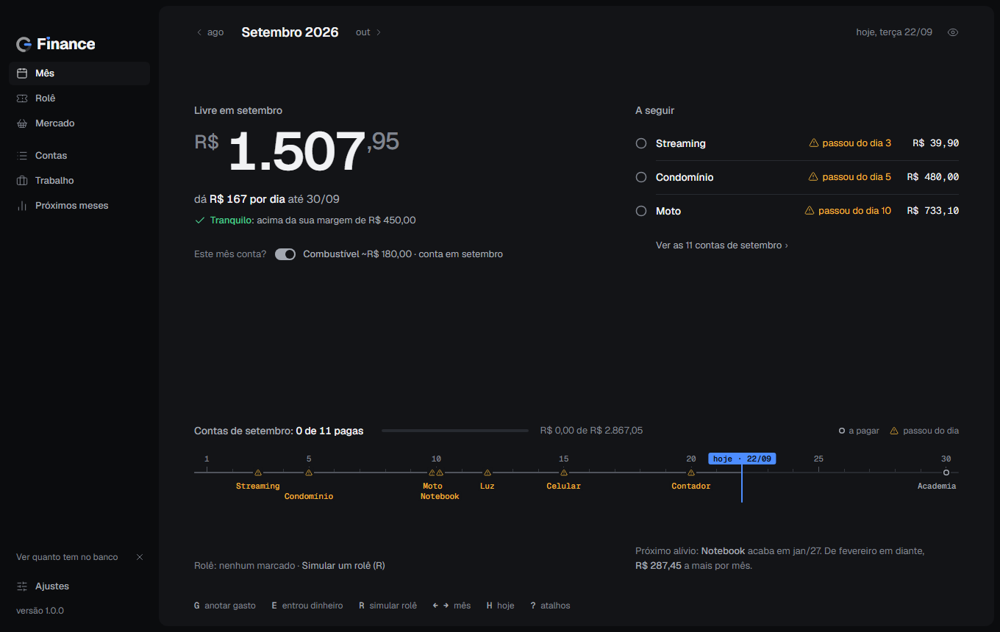
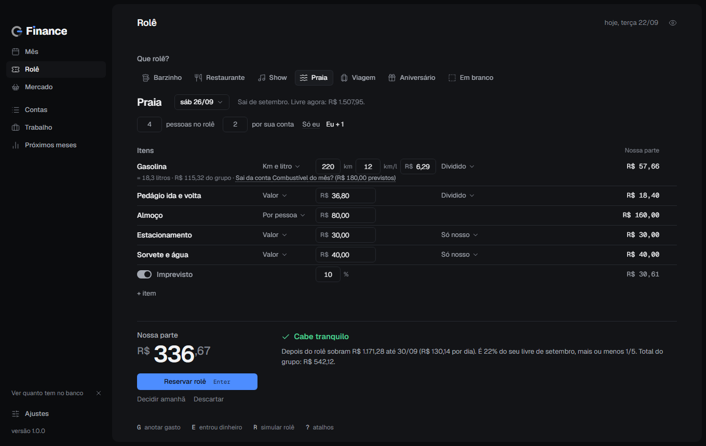
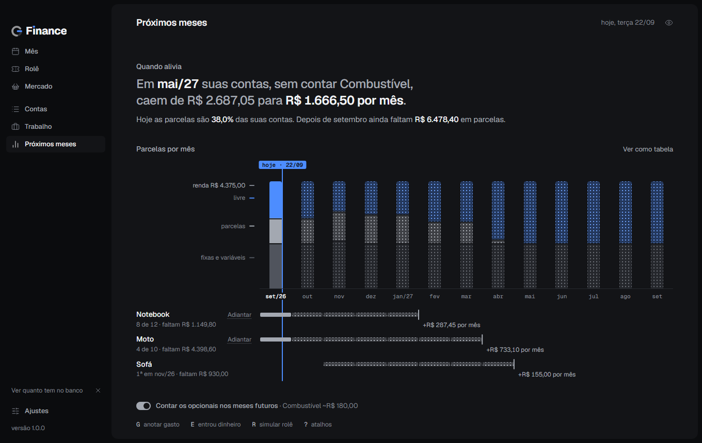

<p align="center"></p>

<h1 align="center">G Finance</h1>

<p align="center"><b>Saiba quanto está livre para gastar até o fim do mês.</b><br>
Programa de Windows para organizar as suas contas. Local, sem conta, sem nuvem, sem anúncio.</p>

<p align="center"><a href="https://github.com/giandomotion/g-finance/releases/latest"><b>Baixar a versão mais nova</b></a></p>



## O que ele faz

- **Um número que manda:** quanto está livre no mês, já descontadas as contas. Sempre calculado, nunca digitado.
- **Contas do jeito que elas são:** fixa, parcelada (mostra quando acaba), variável e "às vezes" (como a gasolina que só entra em alguns meses).
- **Simular um rolê:** monte o fim de semana e veja na hora se cabe no mês.
- **Próximos meses:** quando cada parcela acaba e quanto o mês alivia.
- **Mercado:** a lista do mês inteiro, feita para o tamanho da sua casa.
- **Trabalho e benefícios:** salário que cai sozinho e o saldo do vale no cartão.
- **Importa a sua lista:** cole o bloco de notas onde você já anota as contas e ele monta o mês.

| Rolê | Próximos meses |
|---|---|
|  |  |

## Baixar e instalar

1. Baixe o arquivo `G-Finance_..._x64-setup.exe` na [página de downloads](https://github.com/giandomotion/g-finance/releases/latest).
2. Abra o arquivo e siga o instalador. Não pede senha de administrador.
3. Precisa de Windows 10 ou 11, 64 bits.

### "O Windows protegeu o computador"

Esse aviso aparece com programas novos que ainda não são conhecidos pelo Windows. Para seguir:

1. Clique em **Mais informações**.
2. Clique em **Executar assim mesmo**.

Quer conferir se o arquivo é o original? Cada versão traz o `SHA256SUMS.txt`. No PowerShell, na pasta do download:

```powershell
Get-FileHash .\G-Finance_1.0.0_x64-setup.exe -Algorithm SHA256
```

O número tem que ser igual ao do `SHA256SUMS.txt` da mesma versão.

## Teste grátis e licença

- **7 dias grátis**, com tudo liberado, a partir do primeiro uso.
- Depois do teste, o programa fica **só para consulta** até ser ativado. **Seus dados nunca ficam presos:** backup e exportar continuam funcionando.
- **Para ativar:** no programa, abra **Ativar**, copie o **código do computador** e me mande pelo WhatsApp junto com o seu nome. Eu te envio a chave; é só colar.
- A chave é pessoal e vale para um computador. Trocou de computador ou formatou? Me chama que eu mando uma chave nova.

**WhatsApp: (21) 98150-5668**

## Privacidade

- Seus dados ficam **só no seu computador**. Não existe conta, login nem nuvem.
- Nenhum dado seu é enviado para lugar nenhum. Não há anúncio nem telemetria.
- A única conexão do programa é para perguntar ao GitHub se existe versão nova. Dá para desligar em **Ajustes**.

## Seus dados e backups

- O programa faz **backup sozinho** uma vez por dia em `Documentos\G Finance\Backups`, e antes de cada atualização.
- **Levar para outro computador:** em Ajustes, faça um backup, copie o arquivo e use **Restaurar um backup** no computador novo.
- Desinstalar não apaga os backups.

## Atualizações

- O programa procura versão nova uma vez por dia e mostra um aviso discreto.
- Só instala quando você clica em **Atualizar agora**, e faz um backup antes.
- Toda atualização é **assinada digitalmente**: o programa recusa qualquer arquivo que não tenha sido assinado por mim.

## Perguntas frequentes

**Tem versão para celular?** Ainda não. Por enquanto é só para Windows.

**Sincroniza entre computadores?** Não. É de propósito: sem nuvem, os seus dados ficam só com você.

**E se eu formatar o computador?** Guarde um backup antes (Ajustes > Fazer backup agora). Depois de reinstalar, restaure o backup e me peça uma chave nova para o computador formatado.

**O programa conecta no meu banco?** Não. Você anota as contas e marca o que pagou; ele faz as contas.

---

Isto organiza as suas contas; não é consultoria financeira.

© 2026 Gian. Todos os direitos reservados.
